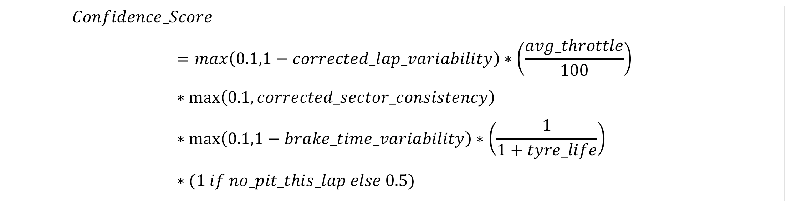
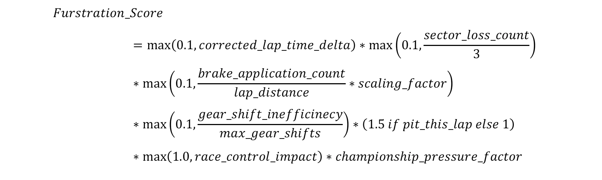
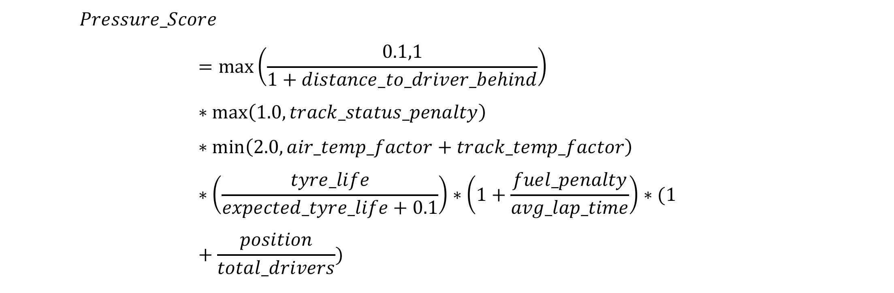
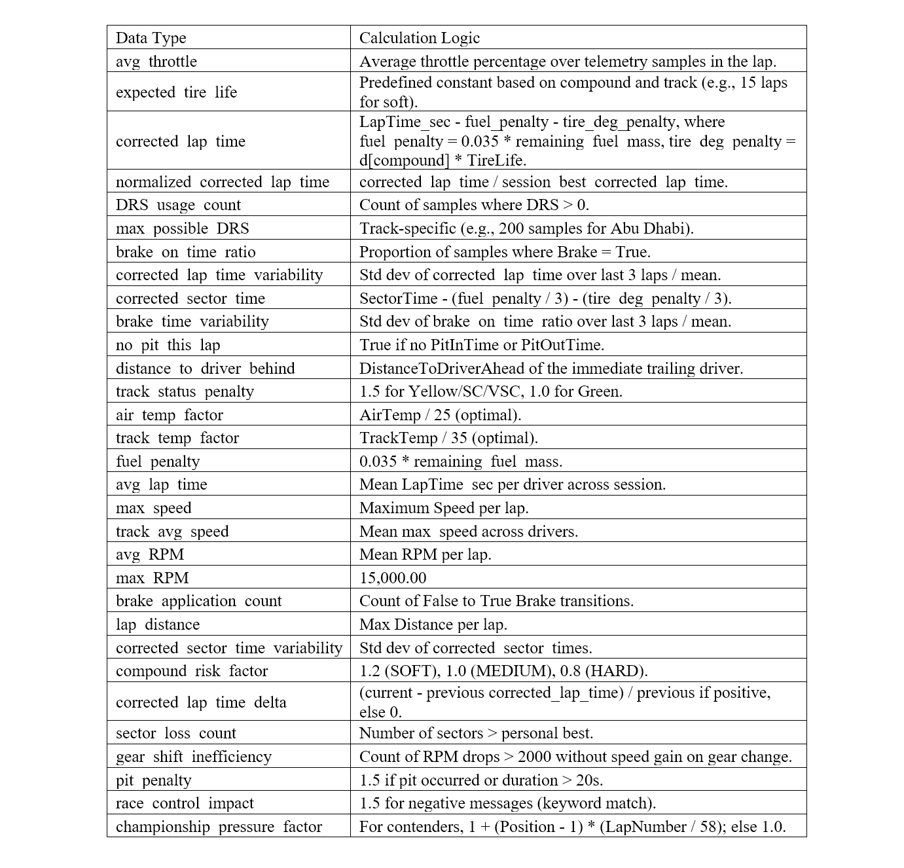

## F1 Driver Emotions Visualization

Interactive recreation of the Abu Dhabi 2021 F1 emotions in a modern web stack. The app uses Next.js 16, React 19, and Three.js to render an orbiting particle ring for every driver and lap, translating telemetry-derived emotion metrics into colour, motion, and bloom intensity.

- **Live exploration** – scrub through laps and see pressure, confidence, frustration, aggressiveness, and risk-taking values per driver.
- **GPU-accelerated scene** – additive particle system with 20k particles + 2k sparks per driver, bloom post-processing, and OrbitControls.
- **Full data pipeline** – A single Python script downloads telemetry via FastF1, computes emotion scores, and stores the JSON the frontend consumes.

---

### Project Layout

- `app/page.tsx` – server component that fetches data with `getEmotionsData()` and renders the visualization.
- `components/F1Visualization.tsx` – client component that mounts the Three.js scene, lap selector, and emotion breakdown UI.
- `lib/emotions.ts` – file-system backed data loader with in-memory caching.
- `data/` – bundled dataset ready for the UI (`f1_emotions_data.json`).
- `src/generator.py` – CLI that fetches telemetry, computes all emotion scores, and rebuilds `data/f1_emotions_data.json`.

---

### Frontend Flow

1. `app/page.tsx` is a server component and calls `getEmotionsData()` during SSR.
2. `F1Visualization` receives the JSON payload and:
   - builds concentric particle rings per driver,
   - maps emotion values to rotation, wobble, shake, thickness, and colour variations,
   - exposes a lap dropdown, per-driver stats, and fallback messaging.
3. Emotion updates are applied by mutating buffer attributes each animation frame for 60fps performance.

---

### Data Pipeline Overview

`src/generator.py` automates the entire backend data prep:

1. Downloads the requested session directly from FastF1 (laps, car telemetry, race control events).
2. Calculates the five emotion scores using telemetry features such as tyre wear, throttle smoothness, position deltas, and DRS usage (logic matches the diagrams below).
3. Normalises scores per lap and writes `data/f1_emotions_data.json` in the exact shape expected by the frontend.
4. Progress bars (via `tqdm`) show driver/lap processing status in the terminal.

---

### Getting Started (Web App)

Prerequisites
- Node.js 18+
- npm 9+

Install and run:

```bash
npm install
npm run dev
```

Visit `http://localhost:3000` and use the lap selector to explore the scene.

Production build:

```bash
npm run build
npm run start
```

Linting:

```bash
npm run lint
```

---

### Regenerating the Dataset

Prerequisites
- Python 3.10+
- `pip install -r requirements.txt`
- FastF1 account/API access (free) for telemetry downloads.

Steps (defaults to the 2021 Abu Dhabi race):

```bash
python src/generator.py
```

Customise the target session as needed:

```bash
python src/generator.py --year 2022 --event "Saudi Arabian" --session R --output data/f1_emotions_data.json
```

Outputs:
- Fresh `data/f1_emotions_data.json` for the frontend (identical schema to the committed sample).
- Cached FastF1 responses under `cache/` for faster reruns (ignored by Git).

---

### Mathematical Model

Below are the derived metrics visualised in the app.

**Aggressiveness**

$$
\text{Aggressiveness\_Score} = 
0.25 \left( \frac{\text{avg\_throttle}}{100} \right)
+ 0.15 \, \max\!\left(0.1, 1 - \frac{\text{tyre\_life}}{\text{expected\_tyre\_life}}\right)
+ 0.2 \left( \frac{1}{\text{normalized\_corrected\_lap\_times}} \right)
+ 0.2 \, e^{\frac{\text{avg\_distance\_to\_drive\_ahead}}{10}}
+ 0.15 \, \frac{\min\!\left(1.0, 2 \times \text{DRS\_usage\_count}\right)}{\text{max\_possible\_DRS}}
+ 0.3
+ 0.05 \left(1 - \text{brake\_on\_time\_ratio}\right)
+ 0.15 \, \min\!\left(1.0, 1 - \frac{\text{position} - 1}{\text{total\_drivers}}\right)
$$


**Confidence**


**Frustration**


**Pressure**


**Risk Taking**


**Extra**



---
